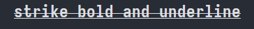
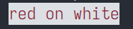
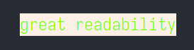

# Reinbow


Reinbow is a Ruby gem for colorizing printed text on terminal.

It was original a fork of the great gem [ku1ik/rainbow](https://github.com/ku1ik/rainbow), but the old codebase took way too much efforts to overhaul, so instead this project was built from ground up.

That means this project has **no relationship** with the original `rainbow` beyond inspiration, **does not** contain codes from it, and **is not** compatible with it either.

```ruby
require "reinbow"

using Reinbow

puts "Blue cat".blue + " " \
    + "jumps over".on_yellow + " " \
    + "big".bold + " " \
    + "lazy meatball".rgb( "#f9e02e" )
```


## Installation

Using Gemfile:

```ruby
gem 'reinbow'
```

Using gem CLI:

```ruby
gem install reinbow
```


## Usage

The intended way to use `reinbow` is by using [*refinement*](https://docs.ruby-lang.org/en/master/Refinement.html) and calling *coloring methods* on String instances. But there's also a method for constructing the underlying `Reinbow::Painter` instances manually.

By default, coloring are enabled or disabled based on [*Standard for ANSI Colors in Terminals*](https://bixense.com/clicolors/), but methods are provided to toggle it manually.

### Refinement

Simply do:

```ruby
# 1) import the gem
require "reinbow"

module DesiredModule
    # 2) "using" the Reinbow refinement in some module
    using Reinbow

    # 3) all string instances in this scope
    # will have coloring methods
    def colored = @message.blue
end
```

Such way `reinbow` doesn't pollute the precious method namespace.

### API

Reinbow by default defines several methods to colorize or style strings, which have their names matching the [*SGR*](https://en.wikipedia.org/wiki/ANSI_escape_code#SGR) counterparts.

Full list of methods for applying terminal effects:

* `#reset`
* `#bold`
* `#dim`
* `#italic`
* `#underline`
* `#blink` *a lot of terminals ignore this for accessability reasons*
* `#invert`
* `#hide`
* `#strike`

Demo:

```ruby
puts "strike bold and underline".strike.bold.underline
```



Full list of methods for coloring foreground and background, with the background ones having `on_` prefix. Note that their *bright* variants are **not yet** supported.

* `#black`
* `#red`
* `#green`
* `#yellow`
* `#blue`
* `#magenta`
* `#cyan`
* `#white`
* `#default`
* `#on_black`
* `#on_red`
* `#on_green`
* `#on_yellow`
* `#on_blue`
* `#on_magenta`
* `#on_cyan`
* `#on_white`
* `#on_default`

Demo:

```ruby
puts "red on white".red.on_white
```



The API also supports coloring with RGB values, and has a shorthand for using HEX string. Reinbow also comes with a full list of [*X11 Color Names*](https://en.wikipedia.org/wiki/X11_color_names). The detailed usage of both of them can be found in the *Examples* section below:

* `#rgb( Reinbow::Rgb | String )`
* `#on_rgb( Reinbow::Rgb | String )`

Demo:

```ruby
puts "great readability" \
    .rgb( X11_COLORS[:lawngreen] ) \
    .on_rgb( "#faf0e6" )
```



All coloring methods return `self` so that all method calls are chainable.

```ruby
puts "well, your terminal, your land" \
    .rgb( X11_COLORS[:coral] ).on_magenta \
    .strike.italic.underline.bold
```


There's also a method for turning reinbow functionality on and off. But note, unlike `rainbow`, there's **no global switch** for toggling it:

* `#reinbow!( boolean )`

And also a method for querying the on-off status:

* `#reinbow?`


### `Reinbow::Painter` Class

`T.B.D.`


## Examples

### RGB Colors and X11 Color Names

`Reinbow::Rgb` is a Data class for holding RGB values. It has following class methods:

* `::new( red: 0..255, green: 0..255, blue: 0..255 )`
* `::[]( 0..255, 0..255, 0..255 )`
* `::hex( String )`

Where `::[]` is a shorthand for the keyword based constructor, and `::hex` is for making `Rgb` instance from plain string HEX, which is case-insensitive and also supports 3-letter HEX.

Example:

```ruby
Rgb.new( red: 1, green: 133, blue: 0 )
# or
Rgb[1, 133, 0]
# or
Rgb.hex( "#0b8500" )

# 3-letter HEX
Rgb.hex( "#abc" ) # => <... red=170, green=187, blue=204>
```

`Reinbow::X11_COLORS` is a predefined hash of [*X11 Colors Names*](https://en.wikipedia.org/wiki/X11_color_names) to their corresponding RGB values. The X11 colors are not provided as coloring methods because there are whopping 130+ of them, which will pollute the instance methods.

Example:

```ruby
X11 = Reinbow::X11_COLORS

puts "crimson line".rgb( X11[:crimson] ).underline
```


## License

[BSD-3-Clause](./LICENSE)
